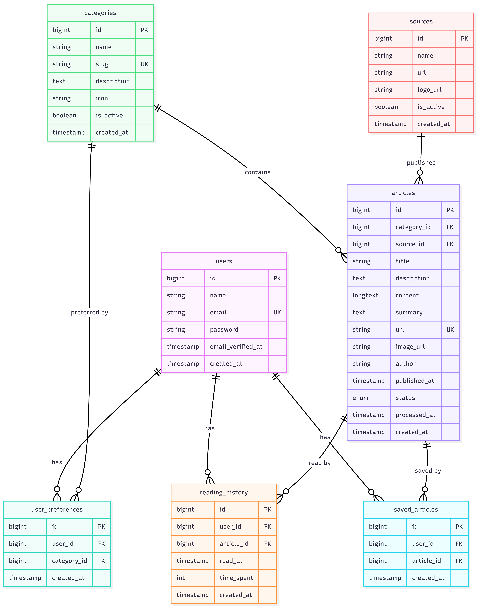
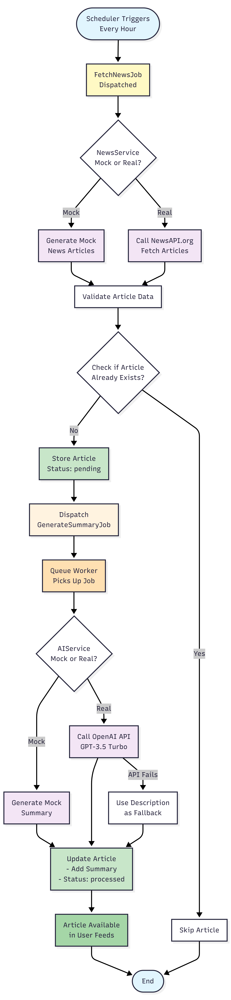

# 📰 Personalized News Feed Platform

> A Laravel-based news aggregation platform with AI-powered article summarization and intelligent content personalization.

**🎯 Technical Interview Project for Newboxes**

[](https://laravel.com)
[](https://php.net)
[](https://mysql.com)
[](https://tailwindcss.com)
[](LICENSE)

---

## 📋 Quick Links

**📖 Complete Submission**: [SUBMISSION.md](SUBMISSION.md)  
**🏗️ Architecture**: [docs/1-SYSTEM-ARCHITECTURE.md](docs/1-SYSTEM-ARCHITECTURE.md)  
**🤖 AI Pipeline**: [docs/2-AI-PIPELINE.md](docs/2-AI-PIPELINE.md)  
**💾 Database**: [docs/3-DATABASE-SCHEMA.md](docs/3-DATABASE-SCHEMA.md)  
**🎨 Wireframes**: [docs/4-WIREFRAMES.md](docs/4-WIREFRAMES.md)  
**💡 Design Decisions**: [docs/5-DESIGN-DECISIONS.md](docs/5-DESIGN-DECISIONS.md)  
**🔧 Implementation**: [docs/6-IMPLEMENTATION-GUIDE.md](docs/6-IMPLEMENTATION-GUIDE.md)

---

## 📊 Visual Overview

### System Architecture


*Complete layered architecture from UI to data storage*

---

### Database Schema


*Entity relationship diagram showing all tables and relationships*

---

### AI Pipeline Flow


*End-to-end data flow from news fetching to AI summarization*

---

## ✨ Key Features

- 📰 **Multi-Source News Aggregation** - Fetch from NewsAPI.org or use mock data
- 🤖 **AI-Powered Summaries** - OpenAI GPT-3.5 generates concise article summaries
- 🎯 **Personalized Feed** - Content tailored to user's selected topics
- 📊 **Reading History Tracking** - Never see the same article twice
- 💾 **Bookmark Articles** - Save interesting articles for later
- 🔍 **Category Filtering** - Technology, Business, Sports, Health, Science, Entertainment
- 📱 **Responsive Design** - Beautiful UI with Tailwind CSS
- ⚡ **Queue-Based Processing** - Asynchronous AI summarization for scalability
- 🔄 **Mock Services** - Development without API dependencies

---

## 🎯 Project Highlights

### What Makes This Special

✅ **Complete Working POC** - Not just diagrams, fully functional application  
✅ **Production-Ready Architecture** - Scalable, maintainable design  
✅ **Comprehensive Documentation** - 6 detailed documents (5,000+ words)  
✅ **Mock Services** - Demo without API keys or costs  
✅ **Clean Code** - Follows Laravel best practices and PSR-12  
✅ **Visual Diagrams** - 6 professional diagrams explaining the system  

### Time Investment
- **Development**: 6-8 hours
- **Documentation**: 3-4 hours
- **Total Lines of Code**: ~2,500 lines
- **Documentation**: 5,000+ words

---

## 🏗️ Architecture

### Layered Architecture
```
┌─────────────────────────────────────────────────────────────┐
│                    PRESENTATION LAYER                       │
│              (Blade Templates + Tailwind CSS)               │
└────────────────────────┬────────────────────────────────────┘
                         │
                         ▼
┌─────────────────────────────────────────────────────────────┐
│                  APPLICATION LAYER                          │
│         (Routes, Middleware, Controllers)                   │
└────────────────────────┬────────────────────────────────────┘
                         │
                         ▼
┌─────────────────────────────────────────────────────────────┐
│                 BUSINESS LOGIC LAYER                        │
│          (Services, Jobs, Business Rules)                   │
└────────────────────────┬────────────────────────────────────┘
                         │
                         ▼
┌─────────────────────────────────────────────────────────────┐
│                  DATA ACCESS LAYER                          │
│              (Eloquent Models, Repositories)                │
└────────────────────────┬────────────────────────────────────┘
                         │
                         ▼
┌─────────────────────────────────────────────────────────────┐
│               INFRASTRUCTURE LAYER                          │
│        (MySQL, Queue, Cache, External APIs)                 │
└─────────────────────────────────────────────────────────────┘
```

**📚 Detailed Architecture**: [docs/1-SYSTEM-ARCHITECTURE.md](docs/1-SYSTEM-ARCHITECTURE.md)

---

## 💻 Tech Stack

| Layer | Technology |
|-------|------------|
| **Backend Framework** | Laravel 10.x |
| **Language** | PHP 8.1+ |
| **Database** | MySQL 8.0 |
| **Queue System** | Laravel Queue (Database Driver) |
| **Template Engine** | Blade |
| **CSS Framework** | Tailwind CSS 3.x |
| **JavaScript** | Vanilla JS |
| **External APIs** | NewsAPI.org, OpenAI GPT-3.5 |
| **Authentication** | Laravel Breeze |
| **Testing** | PHPUnit |

---

## 🚀 Quick Start

### Prerequisites

- **PHP**: 8.1 or higher
- **Composer**: Latest version
- **MySQL**: 8.0 or higher
- **Node.js**: 16.x or higher
- **NPM**: Latest version

### Installation (5 Minutes)
```bash
# 1. Clone the repository
git clone https://github.com/yashpalmodi002/news-feed-platform.git
cd news-feed-platform

# 2. Install PHP dependencies
composer install

# 3. Install Node dependencies
npm install

# 4. Create environment file
cp .env.example .env

# 5. Generate application key
php artisan key:generate

# 6. Configure database in .env
DB_CONNECTION=mysql
DB_HOST=127.0.0.1
DB_PORT=3306
DB_DATABASE=news_feed
DB_USERNAME=root
DB_PASSWORD=your_password

# For development (no API keys needed)
USE_MOCK_SERVICES=true

# 7. Create database
mysql -u root -p
CREATE DATABASE news_feed;
exit;

# 8. Run migrations and seeders
php artisan migrate --seed

# 9. Build frontend assets
npm run build

# 10. Start the application
# Terminal 1: Laravel development server
php artisan serve

# Terminal 2: Queue worker
php artisan queue:work

# Terminal 3: Fetch news (one-time or scheduled)
php artisan news:fetch
```

### Access the Application

- **URL**: http://127.0.0.1:8000
- **Test Account**:
  - Email: `test@example.com`
  - Password: `password`

---

## 🎮 User Flow

### First-Time User Journey

1. **Visit Homepage** → See welcome page
2. **Register Account** → Create user account
3. **Select Topics** → Choose preferred categories (Technology, Business, Sports, etc.)
4. **View Feed** → See personalized news with AI summaries
5. **Read Article** → Click to view full article with AI summary
6. **Save Articles** → Bookmark interesting articles
7. **Return Daily** → See fresh content, no repeated articles

### Application Features

#### Personalized Feed
```
✅ Articles from selected categories only
✅ AI-generated summaries (2-3 sentences)
✅ Never see articles you've already read
✅ Sort by publication date (newest first)
✅ Pagination (20 articles per page)
```

#### Article Detail Page
```
✅ Full article content
✅ Prominent AI summary at top
✅ Author and source information
✅ Save/unsave functionality
✅ Reading time tracking
✅ Related articles
```

#### Saved Articles
```
✅ View all bookmarked articles
✅ Remove from saved list
✅ Quick access to reading list
```

---

## 📖 Complete Documentation

### Architecture & Design

| Document | Description |
|----------|-------------|
| [📋 SUBMISSION.md](SUBMISSION.md) | Complete submission overview and project summary |
| [🏗️ System Architecture](docs/1-SYSTEM-ARCHITECTURE.md) | Layered architecture, components, tech stack |
| [🤖 AI Pipeline](docs/2-AI-PIPELINE.md) | Data flow, AI integration, error handling |
| [💾 Database Schema](docs/3-DATABASE-SCHEMA.md) | ERD, tables, relationships, queries |
| [🎨 Wireframes](docs/4-WIREFRAMES.md) | UI/UX designs, user journey, mockups |
| [💡 Design Decisions](docs/5-DESIGN-DECISIONS.md) | Architecture rationale, trade-offs |
| [🔧 Implementation](docs/6-IMPLEMENTATION-GUIDE.md) | Code walkthrough, setup guide |

### Visual Documentation

All diagrams are available in `docs/images/`:

1. `01-system-architecture.png` - High-level architecture
2. `02-component-architecture.png` - Component breakdown
3. `03-data-flow-sequence.png` - Request/response flow
4. `04-database-schema.png` - Entity relationship diagram
5. `05-ai-pipeline-flow.png` - AI processing workflow
6. `06-user-journey.png` - User experience flow

---

## 🔧 Configuration

### Development Mode (Mock Services)

**No API keys needed!** Perfect for demo and development.
```env
# .env configuration
USE_MOCK_SERVICES=true
NEWSAPI_KEY=
OPENAI_API_KEY=
```

**What you get:**
- ✅ Realistic mock news articles
- ✅ Template-based AI summaries
- ✅ Instant results (no API delays)
- ✅ No costs
- ✅ Works offline

### Production Mode (Real APIs)
```env
# .env configuration
USE_MOCK_SERVICES=false
NEWSAPI_KEY=your_newsapi_key_here
OPENAI_API_KEY=your_openai_key_here
```

**Getting API Keys:**
- **NewsAPI**: https://newsapi.org/register (Free: 100 requests/day)
- **OpenAI**: https://platform.openai.com/api-keys (Pay-as-you-go: ~$0.002/summary)

---

## 🗂️ Project Structure
```
news-feed-platform/
├── app/
│   ├── Console/
│   │   └── Commands/
│   │       └── FetchNewsCommand.php      # Artisan command to fetch news
│   ├── Http/
│   │   └── Controllers/
│   │       ├── FeedController.php        # Feed display and filtering
│   │       ├── ArticleController.php     # Article view and interactions
│   │       └── PreferenceController.php  # User preferences management
│   ├── Models/
│   │   ├── User.php                      # User authentication
│   │   ├── Article.php                   # News articles
│   │   ├── Category.php                  # News categories
│   │   ├── Source.php                    # News publishers
│   │   ├── UserPreference.php            # User topic selections
│   │   ├── ReadingHistory.php            # Reading tracking
│   │   └── SavedArticle.php              # Bookmarked articles
│   ├── Services/
│   │   ├── NewsService.php               # Interface for news fetching
│   │   ├── MockNewsService.php           # Mock news generator
│   │   ├── NewsAPIService.php            # Real NewsAPI integration
│   │   ├── AIService.php                 # Interface for AI
│   │   ├── MockAIService.php             # Mock AI summaries
│   │   └── OpenAIService.php             # Real OpenAI integration
│   └── Jobs/
│       ├── FetchNewsJob.php              # Background news fetching
│       └── GenerateSummaryJob.php        # AI summarization job
├── database/
│   ├── migrations/                       # Database schema
│   │   ├── 2024_01_01_000001_create_categories_table.php
│   │   ├── 2024_01_01_000002_create_sources_table.php
│   │   ├── 2024_01_01_000003_create_articles_table.php
│   │   ├── 2024_01_01_000004_create_user_preferences_table.php
│   │   ├── 2024_01_01_000005_create_reading_history_table.php
│   │   └── 2024_01_01_000006_create_saved_articles_table.php
│   └── seeders/
│       ├── CategorySeeder.php            # Seed 6 categories
│       └── UserSeeder.php                # Create test user
├── docs/                                 # Complete documentation
│   ├── images/                           # Visual diagrams
│   ├── 1-SYSTEM-ARCHITECTURE.md
│   ├── 2-AI-PIPELINE.md
│   ├── 3-DATABASE-SCHEMA.md
│   ├── 4-WIREFRAMES.md
│   ├── 5-DESIGN-DECISIONS.md
│   └── 6-IMPLEMENTATION-GUIDE.md
├── resources/
│   └── views/
│       ├── layouts/
│       │   └── app.blade.php             # Main layout
│       ├── feed/
│       │   ├── index.blade.php           # Personalized feed
│       │   ├── category.blade.php        # Category filtered feed
│       │   └── saved.blade.php           # Saved articles
│       ├── articles/
│       │   └── show.blade.php            # Article detail page
│       └── preferences/
│           └── index.blade.php           # Topic selection
├── routes/
│   └── web.php                           # Application routes
├── SUBMISSION.md                         # Submission overview
└── README.md                             # This file
```

---

## 📊 Database Schema

### Core Tables

| Table | Purpose | Key Relationships |
|-------|---------|------------------|
| `users` | User accounts | Has preferences, history, saved articles |
| `categories` | News topics | Has articles, user preferences |
| `sources` | Publishers | Has articles |
| `articles` | News + AI summaries | Belongs to category & source |
| `user_preferences` | Topic selections | Links users to categories |
| `reading_history` | Reading tracking | Links users to articles read |
| `saved_articles` | Bookmarks | Links users to saved articles |

### Key Relationships
```
users (1) ──< user_preferences >── (N) categories
  │                                        │
  ├──< reading_history >──┐                │
  │                       │                │
  └──< saved_articles >───┼───< articles ├─┘
                          │        │
                          └────────┘
                                   │
                              sources (1)
```

**📚 Detailed Schema**: [docs/3-DATABASE-SCHEMA.md](docs/3-DATABASE-SCHEMA.md)

---

## 🎯 Key Design Patterns

### Repository Pattern
- Clean separation between data access and business logic
- Eloquent models act as repositories
- Easy to test and maintain

### Service Layer Pattern
- Business logic encapsulated in service classes
- Thin controllers (single responsibility)
- Reusable across the application

### Queue Pattern
- Asynchronous processing for heavy operations
- Better user experience (no waiting)
- Horizontally scalable
- Automatic retry with exponential backoff

### Interface-Based Design
- Easy to swap between Mock and Real implementations
- Configuration-driven (USE_MOCK_SERVICES)
- Testable and flexible

**📚 Full Details**: [docs/5-DESIGN-DECISIONS.md](docs/5-DESIGN-DECISIONS.md)

---

## 📈 Scalability Path

### Current: Proof of Concept
- **Users**: 10-100 concurrent
- **Infrastructure**: Single server
- **Queue**: Database driver
- **Cache**: File-based

### Phase 1: Small Scale (100-1K users)
- Add Redis for caching and queue
- Multiple queue workers
- Database read replicas
- Basic monitoring

### Phase 2: Medium Scale (1K-10K users)
- Load balancer + multiple app servers
- CDN for static assets
- Elasticsearch for search
- Advanced caching strategies

### Phase 3: Large Scale (10K+ users)
- Microservices architecture
- Separate AI processing service
- Kafka event streaming
- Auto-scaling infrastructure
- Distributed cache

**📚 Scalability Strategy**: [docs/5-DESIGN-DECISIONS.md](docs/5-DESIGN-DECISIONS.md#scalability-considerations)

---

## 🔐 Security Features

### Authentication & Authorization
✅ Laravel Breeze (session-based authentication)  
✅ bcrypt password hashing  
✅ CSRF protection on all forms  
✅ Middleware-based route protection  

### Data Protection
✅ SQL injection prevention (Eloquent ORM)  
✅ XSS protection (Blade template escaping)  
✅ Prepared statements for all queries  
✅ Input validation and sanitization  

### API Security
✅ API keys stored in .env (never committed)  
✅ Rate limiting on external API calls  
✅ Timeout and retry mechanisms  
✅ Fallback for API failures  

---

## 🧪 Testing

### Run Tests
```bash
# Run all tests
php artisan test

# Run specific test suite
php artisan test --testsuite=Feature

# Run with coverage
php artisan test --coverage
```

### Test Structure
```
tests/
├── Feature/
│   ├── FeedTest.php              # Feed generation tests
│   ├── ArticleTest.php           # Article viewing tests
│   └── PreferenceTest.php        # Preference management tests
└── Unit/
    ├── NewsServiceTest.php       # News fetching tests
    ├── AIServiceTest.php         # AI summary tests
    └── FeedServiceTest.php       # Feed logic tests
```

---

## 🚀 Deployment

### Production Checklist

- [ ] Set `APP_ENV=production` in .env
- [ ] Set `APP_DEBUG=false` in .env
- [ ] Configure production database
- [ ] Set up Redis for cache and queue
- [ ] Configure supervisor for queue workers
- [ ] Set up SSL certificate (HTTPS)
- [ ] Configure CDN for assets
- [ ] Set up error monitoring (Sentry)
- [ ] Configure automated backups
- [ ] Set up logging and monitoring

### Recommended Stack

**For 1K-10K users:**
```
├── Application Server: AWS EC2 / DigitalOcean Droplet
├── Database: Amazon RDS (MySQL)
├── Cache/Queue: Amazon ElastiCache (Redis)
├── Storage: Amazon S3
├── CDN: CloudFront / Cloudflare
└── Load Balancer: AWS ALB
```

**Cost Estimate**: $100-200/month

---

## 📝 Available Commands

### Artisan Commands
```bash
# Fetch news articles
php artisan news:fetch

# Start queue worker
php artisan queue:work

# Clear all caches
php artisan optimize:clear

# Run database migrations
php artisan migrate

# Seed database with sample data
php artisan db:seed

# Run tests
php artisan test
```

### NPM Commands
```bash
# Install dependencies
npm install

# Build for production
npm run build

# Build for development with watch
npm run dev
```

---

## 💰 Cost Analysis

### Development (Mock Services)
- **NewsAPI**: $0/month (using mock)
- **OpenAI**: $0/month (using mock)
- **Total**: **$0/month** ✅

### Production (1,000 users, 10K articles/month)
- **NewsAPI**: Free tier (100/day) or $449/month (unlimited)
- **OpenAI**: ~$20/month (10K summaries @ $0.002 each)
- **Server**: $20-50/month (VPS)
- **Total**: **$40-520/month**

### Budget Option
- **RSS Feeds**: Free
- **Hugging Face (Open-source AI)**: Free
- **Server**: $20/month
- **Total**: **$20/month** ✅

---

## 🤝 Contributing

This is a technical interview project. If you'd like to suggest improvements:

1. Fork the repository
2. Create feature branch (`git checkout -b feature/AmazingFeature`)
3. Commit changes (`git commit -m 'Add some AmazingFeature'`)
4. Push to branch (`git push origin feature/AmazingFeature`)
5. Open Pull Request

---

## 📄 License

This project is open-source software licensed under the [MIT License](LICENSE).

---

## 🔗 Repository

**Live Repository**: https://github.com/yashpalmodi002/news-feed-platform

---
