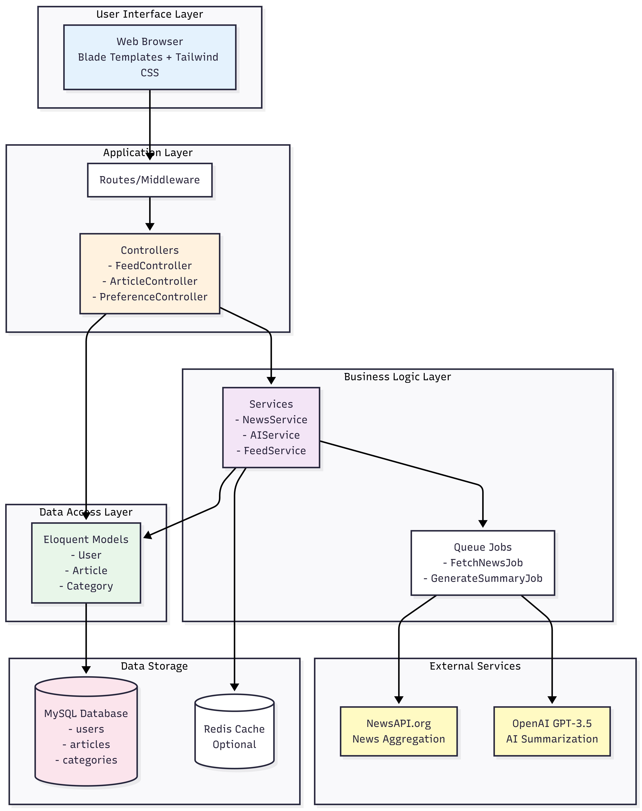
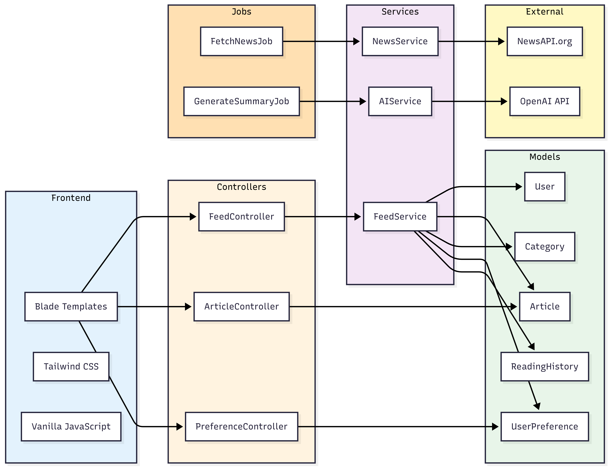

# System Architecture

## Overview

This document describes the complete system architecture of the Personalized News Feed Platform, including all layers, components, and their interactions.

---

## 1. High-Level System Architecture



*Figure 1.1: High-level system architecture showing all layers from UI to data storage*

### Architecture Layers

The system follows a **layered architecture pattern** with clear separation of concerns:

#### **Presentation Layer**
- **Technology**: Blade Templates + Tailwind CSS
- **Purpose**: User interface rendering and client-side interactions
- **Components**: Login, Registration, Feed, Article View, Preferences

#### **Application Layer**
- **Technology**: Laravel Routes, Middleware, Controllers
- **Purpose**: Handle HTTP requests, route to appropriate handlers
- **Components**: 
  - FeedController - Personalized feed management
  - ArticleController - Article viewing and interactions
  - PreferenceController - User preference management

#### **Business Logic Layer**
- **Technology**: Service Classes, Queue Jobs
- **Purpose**: Core business logic and processing
- **Components**:
  - NewsService - News fetching abstraction (Mock/Real)
  - AIService - AI summarization abstraction (Mock/OpenAI)
  - FeedService - Personalized feed generation
  - FetchNewsJob - Background news fetching
  - GenerateSummaryJob - AI summary generation

#### **Data Access Layer**
- **Technology**: Eloquent ORM Models
- **Purpose**: Database abstraction and relationships
- **Components**: User, Article, Category, UserPreference, ReadingHistory, SavedArticle, Source

#### **Infrastructure Layer**
- **Technology**: MySQL, Redis (optional), External APIs
- **Purpose**: Data storage and external integrations
- **Components**: Database, Cache, Queue System, NewsAPI, OpenAI

---

## 2. Component Architecture



*Figure 1.2: Detailed component interactions and dependencies*

### Component Breakdown

#### **Frontend Components**
```
Blade Templates
├── layouts/app.blade.php (Main layout)
├── feed/index.blade.php (News feed)
├── feed/category.blade.php (Category filtered feed)
├── feed/saved.blade.php (Saved articles)
├── articles/show.blade.php (Article detail)
└── preferences/index.blade.php (Topic selection)
```

#### **Controller Layer**
```
Controllers
├── FeedController
│   ├── index() - Display personalized feed
│   ├── category() - Filter by category
│   └── saved() - Show saved articles
├── ArticleController
│   ├── show() - Display article with AI summary
│   ├── markAsRead() - Track reading
│   └── toggleSave() - Save/unsave article
└── PreferenceController
    ├── index() - Show preferences page
    └── update() - Save user preferences
```

#### **Service Layer**
```
Services
├── NewsService (Interface)
│   ├── MockNewsService - Generates fake news
│   └── NewsAPIService - Fetches from NewsAPI.org
├── AIService (Interface)
│   ├── MockAIService - Generates template summaries
│   └── OpenAIService - Uses GPT-3.5
└── FeedService
    └── generatePersonalizedFeed() - Creates user feed
```

#### **Job Layer**
```
Queue Jobs
├── FetchNewsJob
│   └── Fetches news and stores in database
└── GenerateSummaryJob
    └── Generates AI summaries for articles
```

---

## 3. Data Flow Sequence


*Figure 1.3: Complete request/response flow through the system*

### Key User Flows

#### **Flow 1: User Registration & Onboarding**
1. User visits website
2. Clicks "Register"
3. Fills registration form
4. System creates user account
5. Redirects to topic selection
6. User selects preferred categories
7. Preferences saved to database
8. Redirects to personalized feed

#### **Flow 2: News Fetching (Background)**
1. Laravel Scheduler triggers every hour
2. Dispatches FetchNewsJob to queue
3. Job calls NewsService
4. NewsService fetches from API or generates mock data
5. Articles validated and checked for duplicates
6. New articles stored with status='pending'
7. GenerateSummaryJob dispatched for each article
8. Queue worker processes AI summarization
9. Article updated with summary, status='processed'

#### **Flow 3: Viewing Personalized Feed**
1. User clicks "Feed"
2. FeedController receives request
3. Queries user preferences
4. Fetches articles matching preferences
5. Excludes already-read articles
6. Orders by published date
7. Returns paginated results
8. Blade renders feed with AI summaries

#### **Flow 4: Reading Article**
1. User clicks article title
2. ArticleController loads article
3. Checks if user has read before
4. Renders article with AI summary
5. JavaScript tracks time spent
6. On page leave, sends AJAX request
7. System records in reading_history
8. Article won't appear in future feeds

---

## 4. Technology Stack

### Backend Technologies
- **Framework**: Laravel 10.x
- **Language**: PHP 8.1+
- **Database**: MySQL 8.0
- **Queue Driver**: Database (Redis recommended for production)
- **Cache**: File (Redis recommended for production)

### Frontend Technologies
- **Template Engine**: Blade
- **CSS Framework**: Tailwind CSS 3.x
- **JavaScript**: Vanilla JS (no framework)
- **Icons**: Emoji-based

### External Services
- **News API**: NewsAPI.org (Free tier: 100 requests/day)
- **AI API**: OpenAI GPT-3.5 Turbo (~$0.002 per summary)

### Development Tools
- **Composer**: PHP dependency management
- **NPM**: Frontend asset management
- **Artisan**: Laravel CLI
- **Git**: Version control

---

## 5. Design Patterns Used

### Repository Pattern
- Separates data access logic from business logic
- Models act as repositories with Eloquent ORM
- Easy to test and maintain

### Service Layer Pattern
- Encapsulates business logic
- Controllers remain thin
- Services are reusable across controllers

### Factory Pattern
- Used for creating NewsService and AIService instances
- Easy to swap between Mock and Real implementations
- Configuration-driven selection

### Observer Pattern
- Eloquent model events
- Job dispatching on article creation
- Event-driven architecture foundation

### Queue Pattern
- Asynchronous processing
- Better user experience (no waiting)
- Horizontal scalability
- Retry mechanisms

---

## 6. Security Architecture

### Authentication
- Laravel Breeze (session-based)
- bcrypt password hashing
- CSRF protection on all forms
- Email verification (optional)

### Authorization
- Middleware-based route protection
- User can only access their own data
- Article access is public (read-only)

### Data Protection
- SQL injection prevention via Eloquent ORM
- XSS protection via Blade escaping
- Prepared statements for all queries
- Input validation and sanitization

### API Security
- API keys stored in .env (never committed)
- Rate limiting on external API calls
- Retry mechanisms with exponential backoff
- Fallback mechanisms for API failures

---

## 7. Scalability Considerations

### Current State (POC)
- Single server deployment
- Database-based queue
- File-based cache
- Supports: 10-100 concurrent users

### Phase 1: Small Scale (100-1K users)
- Add Redis for caching and queue
- Multiple queue workers
- Database read replicas
- Basic monitoring

### Phase 2: Medium Scale (1K-10K users)
- Load balancer with multiple app servers
- CDN for static assets and images
- Elasticsearch for article search
- Advanced caching strategies

### Phase 3: Large Scale (10K+ users)
- Microservices architecture
- Separate AI processing service
- Kafka for event streaming
- Auto-scaling infrastructure
- Distributed caching with Redis Cluster

---

## 8. Error Handling & Monitoring

### Error Handling Strategy
- Try-catch blocks in critical paths
- Queue job retry with exponential backoff
- Fallback mechanisms for external APIs
- User-friendly error messages
- Detailed error logging

### Monitoring (Recommended for Production)
- Application monitoring: Laravel Telescope
- Error tracking: Sentry or Bugsnag
- Performance monitoring: New Relic or DataDog
- Log aggregation: ELK Stack or CloudWatch

---

## 9. Deployment Architecture

### Development Environment
```
Local Machine
├── XAMPP (Apache + MySQL + PHP)
├── Node.js for asset compilation
└── Git for version control
```

### Production Environment (Recommended)
```
Cloud Infrastructure (AWS/DigitalOcean/Heroku)
├── Application Server (EC2/Droplet)
├── Database Server (RDS/Managed MySQL)
├── Cache Server (ElastiCache/Managed Redis)
├── Queue Workers (Background processes)
├── CDN (CloudFront/Cloudflare)
└── Load Balancer (ALB/HAProxy)
```

---

## 10. API Integration Architecture

### NewsAPI Integration
- Endpoint: `https://newsapi.org/v2/top-headlines`
- Authentication: API Key in header
- Rate Limit: 100 requests/day (free tier)
- Response caching: 1 hour
- Fallback: Mock service if API fails

### OpenAI Integration
- Model: GPT-3.5 Turbo
- Endpoint: `https://api.openai.com/v1/chat/completions`
- Authentication: Bearer token
- Cost: ~$0.002 per summary
- Timeout: 30 seconds
- Retry: 3 attempts with exponential backoff
- Fallback: Use article description

---

## Summary

This architecture provides:
✅ **Scalability** - Can grow from POC to production  
✅ **Maintainability** - Clean separation of concerns  
✅ **Testability** - Interface-based design  
✅ **Flexibility** - Easy to swap implementations  
✅ **Performance** - Queue-based async processing  
✅ **Security** - Multiple layers of protection  

The system is production-ready with a clear path for growth and enhancement.