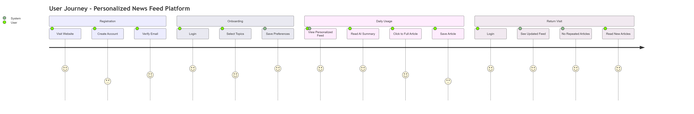

# UI/UX Wireframes

## Overview

This document presents the complete user interface design, user journey, and wireframes for all key screens in the application.

---

## 1. User Journey Map



*Figure 4.1: Complete user journey from discovery to daily usage*

---

## 2. User Journey Stages

### Stage 1: Discovery & Registration

#### Step 1.1: Landing Page
```
┌────────────────────────────────────────────┐
│  📰 Personalized News Feed Platform        │
│  ──────────────────────────────────────    │
│                                            │
│  Get AI-powered news summaries             │
│  tailored to your interests                │
│                                            │
│  [Get Started] [Learn More]                │
└────────────────────────────────────────────┘
```

**Features:**
- Clear value proposition
- Call-to-action buttons
- Sample feed preview
- Trust indicators

---

#### Step 1.2: Registration Form
```
┌────────────────────────────────────────────┐
│  Create Your Account                       │
│  ─────────────────────                     │
│                                            │
│  Name:     [________________]              │
│  Email:    [________________]              │
│  Password: [________________]              │
│                                            │
│  [ ] I agree to Terms & Privacy Policy     │
│                                            │
│  [Create Account]                          │
│                                            │
│  Already have an account? [Login]          │
└────────────────────────────────────────────┘
```

**Features:**
- Simple 3-field form
- Password strength indicator
- Terms acceptance
- Login link for existing users

---

### Stage 2: Onboarding

#### Step 2.1: Topic Selection
```
┌────────────────────────────────────────────┐
│  Select Your Interests                     │
│  ────────────────────                      │
│                                            │
│  Choose topics you'd like to follow:       │
│                                            │
│  ┌──────┐ ┌──────┐ ┌──────┐               │
│  │  💻  │ │  💼  │ │  ⚽  │               │
│  │ Tech │ │ Biz  │ │Sport │               │
│  └──────┘ └──────┘ └──────┘               │
│                                            │
│  ┌──────┐ ┌──────┐ ┌──────┐               │
│  │  🏥  │ │  🔬  │ │  🎬  │               │
│  │Health│ │ Sci  │ │ Ent  │               │
│  └──────┘ └──────┘ └──────┘               │
│                                            │
│  Selected: Technology, Business            │
│                                            │
│  [Continue to Feed]                        │
└────────────────────────────────────────────┘
```

**Features:**
- Visual category cards with icons
- Multi-select capability
- Clear selected state
- Minimum 1 category required

**User Experience:**
- First-time users see this immediately after registration
- Existing users can update from settings
- Visually appealing with large touch targets

---

### Stage 3: Daily Usage

#### Step 3.1: Personalized Feed
```
┌────────────────────────────────────────────────────────────┐
│  📰 Your Feed    [💻Tech] [💼Business] [⚽Sports] [More▼]  │
├────────────────────────────────────────────────────────────┤
│                                                            │
│  ┌────────────────────────────────────────────────────┐   │
│  │ [Image: Tech News]                                 │   │
│  │                                                    │   │
│  │ 💻 Technology • TechCrunch • 2 hours ago           │   │
│  │                                                    │   │
│  │ Breaking: OpenAI Releases GPT-5 with Enhanced     │   │
│  │ Reasoning Capabilities                            │   │
│  │                                                    │   │
│  │ 🤖 AI Summary:                                     │   │
│  │ OpenAI announced GPT-5 today, featuring improved  │   │
│  │ reasoning and multimodal capabilities. The model  │   │
│  │ shows 40% better performance on complex tasks...  │   │
│  │                                                    │   │
│  │ [💾 Save] [👁️ Read More] [🔗 Source]              │   │
│  └────────────────────────────────────────────────────┘   │
│                                                            │
│  ┌────────────────────────────────────────────────────┐   │
│  │ [Image: Business News]                             │   │
│  │                                                    │   │
│  │ 💼 Business • Bloomberg • 4 hours ago              │   │
│  │                                                    │   │
│  │ Tesla Stock Surges 15% Following Q4 Earnings      │   │
│  │ Report Beat                                        │   │
│  │                                                    │   │
│  │ 🤖 AI Summary:                                     │   │
│  │ Tesla reported record Q4 earnings, beating        │   │
│  │ analyst expectations. Revenue increased by 25%... │   │
│  │                                                    │   │
│  │ [💾 Save] [👁️ Read More] [🔗 Source]              │   │
│  └────────────────────────────────────────────────────┘   │
│                                                            │
│  [Load More Articles]                                      │
│                                                            │
├────────────────────────────────────────────────────────────┤
│  [🏠 Home] [💾 Saved] [⚙️ Preferences] [👤 Profile]       │
└────────────────────────────────────────────────────────────┘
```

**Features:**
- Category filter chips at top
- Article cards with images
- AI summary preview
- Quick actions (Save, Read, Source)
- Infinite scroll / Load more
- Bottom navigation

**Key Elements:**
1. **Category Badge** - Shows article category
2. **Source & Time** - Publisher and publish time
3. **Headline** - Attention-grabbing title
4. **AI Summary** - 2-3 sentence preview
5. **Action Buttons** - Save, Read, Source link

---

#### Step 3.2: Article Detail View
```
┌────────────────────────────────────────────────────────────┐
│  [← Back]                                  [💾 Save] [Share]│
├────────────────────────────────────────────────────────────┤
│                                                            │
│  [Full Width Article Image]                               │
│                                                            │
│  💻 Technology • TechCrunch • Jan 22, 2026                 │
│                                                            │
│  Breaking: OpenAI Releases GPT-5 with                     │
│  Enhanced Reasoning Capabilities                          │
│                                                            │
│  By Sarah Johnson                                         │
│  ─────────────────────────────────────────────────────    │
│                                                            │
│  ┌──────────────────────────────────────────────────┐    │
│  │ 🤖 AI-Generated Summary                          │    │
│  │ ────────────────────────                         │    │
│  │                                                  │    │
│  │ OpenAI announced GPT-5 today, marking a         │    │
│  │ significant leap in AI capabilities. The new     │    │
│  │ model demonstrates 40% better performance on     │    │
│  │ complex reasoning tasks and includes enhanced    │    │
│  │ multimodal features. Industry experts predict    │    │
│  │ this will accelerate AI adoption across          │    │
│  │ enterprise applications.                         │    │
│  │                                                  │    │
│  │ [Read Full Article ↓]                            │    │
│  └──────────────────────────────────────────────────┘    │
│                                                            │
│  Full Article Content                                     │
│  ─────────────────────                                    │
│                                                            │
│  In a groundbreaking announcement today, OpenAI           │
│  revealed GPT-5, their latest and most capable            │
│  language model to date. The release comes 18             │
│  months after GPT-4 and brings substantial                │
│  improvements in reasoning, creativity, and               │
│  multimodal understanding.                                │
│                                                            │
│  [... full article text continues ...]                    │
│                                                            │
│  ─────────────────────────────────────────────────────    │
│                                                            │
│  Related Articles:                                        │
│  • "AI Industry Reacts to GPT-5 Launch"                   │
│  • "Comparing GPT-5 to Claude and Gemini"                 │
│  • "What GPT-5 Means for Developers"                      │
│                                                            │
│  [Read Original Article at TechCrunch →]                  │
│                                                            │
└────────────────────────────────────────────────────────────┘
```

**Features:**
- Prominent AI summary at top
- Collapsible full article
- Related articles
- Save and share functionality
- Source link to original

**User Experience:**
- Summary-first approach
- Option to read full article
- Automatic reading time tracking
- Responsive layout

---

#### Step 3.3: Saved Articles
```
┌────────────────────────────────────────────────────────────┐
│  💾 Saved Articles                                         │
├────────────────────────────────────────────────────────────┤
│                                                            │
│  You have 12 saved articles                               │
│                                                            │
│  ┌────────────────────────────────────────────────────┐   │
│  │ 💻 Technology • Saved 2 days ago                   │   │
│  │                                                    │   │
│  │ OpenAI Releases GPT-5...                          │   │
│  │                                                    │   │
│  │ [✓ Read] [🗑️ Remove]                               │   │
│  └────────────────────────────────────────────────────┘   │
│                                                            │
│  ┌────────────────────────────────────────────────────┐   │
│  │ 💼 Business • Saved 3 days ago                     │   │
│  │                                                    │   │
│  │ Tesla Stock Surges 15%...                         │   │
│  │                                                    │   │
│  │ [✓ Read] [🗑️ Remove]                               │   │
│  └────────────────────────────────────────────────────┘   │
│                                                            │
│  [Clear All Read Articles]                                │
│                                                            │
├────────────────────────────────────────────────────────────┤
│  [🏠 Home] [💾 Saved] [⚙️ Preferences] [👤 Profile]       │
└────────────────────────────────────────────────────────────┘
```

**Features:**
- List of all saved articles
- Read/Unread status
- Remove from saved
- Bulk actions
- Sort by date saved

---

#### Step 3.4: Preferences/Settings
```
┌────────────────────────────────────────────────────────────┐
│  ⚙️ Preferences                                            │
├────────────────────────────────────────────────────────────┤
│                                                            │
│  Your Topics                                               │
│  ────────────                                              │
│                                                            │
│  Select topics you want to follow:                         │
│                                                            │
│  ┌──────┐ ┌──────┐ ┌──────┐                              │
│  │  ✓   │ │  ✓   │ │      │                              │
│  │  💻  │ │  💼  │ │  ⚽  │                              │
│  │ Tech │ │ Biz  │ │Sport │                              │
│  └──────┘ └──────┘ └──────┘                              │
│                                                            │
│  ┌──────┐ ┌──────┐ ┌──────┐                              │
│  │      │ │  ✓   │ │      │                              │
│  │  🏥  │ │  🔬  │ │  🎬  │                              │
│  │Health│ │ Sci  │ │ Ent  │                              │
│  └──────┘ └──────┘ └──────┘                              │
│                                                            │
│  Currently following: Technology, Business, Science        │
│                                                            │
│  [Save Preferences]                                        │
│                                                            │
│  ─────────────────────────────────────────────────────    │
│                                                            │
│  Account Settings                                          │
│  ────────────────                                          │
│                                                            │
│  • Update Profile                                          │
│  • Change Password                                         │
│  • Email Notifications                                     │
│  • Privacy Settings                                        │
│  • Logout                                                  │
│                                                            │
└────────────────────────────────────────────────────────────┘
```

**Features:**
- Easy topic management
- Account settings
- Logout option
- Clear visual feedback

---

### Stage 4: Return Visit Experience

#### Key Features for Returning Users:

**No Repeated Articles:**
```php
// System excludes articles user has already read
WHERE article_id NOT IN (reading_history)
```

**Fresh Content:**
```
Welcome back, John!
You have 15 new articles since your last visit
```

**Personalized Insights:**
```
📊 Your Reading Stats
- Articles read today: 5
- Total articles read: 127
- Favorite category: Technology (45%)
- Reading time this week: 2.5 hours
```

---

## 3. Mobile Responsive Design

### Mobile Feed View
```
┌──────────────────────┐
│  📰 Your Feed    [☰] │
├──────────────────────┤
│                      │
│  [💻][💼][⚽][More]   │
│                      │
│  ┌────────────────┐  │
│  │  [Image]       │  │
│  │                │  │
│  │ 💻 Tech • 2h   │  │
│  │                │  │
│  │ Breaking: AI   │  │
│  │ News...        │  │
│  │                │  │
│  │ 🤖 Summary...  │  │
│  │                │  │
│  │ [Save] [Read]  │  │
│  └────────────────┘  │
│                      │
│  ┌────────────────┐  │
│  │  [Image]       │  │
│  │                │  │
│  │ 💼 Biz • 4h    │  │
│  │                │  │
│  │ Tesla Stock... │  │
│  │                │  │
│  │ 🤖 Summary...  │  │
│  │                │  │
│  │ [Save] [Read]  │  │
│  └────────────────┘  │
│                      │
├──────────────────────┤
│ [🏠][💾][⚙️][👤]    │
└──────────────────────┘
```

**Mobile Optimizations:**
- Stack layout (single column)
- Larger touch targets
- Simplified navigation
- Swipe gestures
- Bottom navigation bar

---

## 4. Design System

### Color Palette
```
Primary:   #3B82F6 (Blue)
Secondary: #8B5CF6 (Purple)
Success:   #10B981 (Green)
Warning:   #F59E0B (Orange)
Error:     #EF4444 (Red)
Gray:      #6B7280 (Neutral)

Background: #F9FAFB (Light Gray)
Surface:    #FFFFFF (White)
Text:       #111827 (Almost Black)
```

### Typography
```
Headings:  'Inter', sans-serif
Body:      'Inter', sans-serif
Code:      'Fira Code', monospace

H1: 32px / Bold
H2: 24px / Bold
H3: 20px / Semibold
Body: 16px / Regular
Small: 14px / Regular
```

### Spacing System
```
xs:  4px
sm:  8px
md:  16px
lg:  24px
xl:  32px
2xl: 48px
3xl: 64px
```

### Component Library

**Button Variants:**
```
[Primary Button]    - Blue, white text
[Secondary Button]  - White, blue text, blue border
[Success Button]    - Green, white text
[Danger Button]     - Red, white text
[Ghost Button]      - Transparent, gray text
```

**Card Styles:**
```
┌──────────────────┐
│  [Content]       │  - White background
│                  │  - Rounded corners
│                  │  - Subtle shadow
│                  │  - Hover effect
└──────────────────┘
```

---

## 5. Accessibility

### WCAG 2.1 Level AA Compliance

**Color Contrast:**
- Text: 4.5:1 minimum
- Large text: 3:1 minimum
- Interactive elements: 3:1 minimum

**Keyboard Navigation:**
- All interactive elements focusable
- Logical tab order
- Skip to main content link
- Focus indicators visible

**Screen Reader Support:**
- Semantic HTML
- ARIA labels where needed
- Alt text for all images
- Descriptive link text

**Responsive:**
- Works from 320px to 2560px width
- Touch targets min 44x44px
- Readable at 200% zoom

---

## 6. User Flow Summary

### Happy Path (Successful Journey)
```
1. Land on homepage
   ↓
2. Click "Get Started"
   ↓
3. Fill registration form
   ↓
4. Select 2-3 topics
   ↓
5. See personalized feed
   ↓
6. Read AI summary
   ↓
7. Click to read full article
   ↓
8. Save interesting articles
   ↓
9. Return daily for fresh content
```

### Alternative Paths

**Existing User:**
```
1. Click "Login"
   ↓
2. Enter credentials
   ↓
3. See personalized feed
```

**Change Preferences:**
```
1. Go to Settings
   ↓
2. Update topics
   ↓
3. Save preferences
   ↓
4. See updated feed
```

---

## Summary

### UX Principles Applied

✅ **User-Centered Design** - Focused on reader needs  
✅ **Simplicity** - Minimal clicks to value  
✅ **Consistency** - Familiar patterns throughout  
✅ **Feedback** - Clear system responses  
✅ **Accessibility** - Usable by everyone  
✅ **Performance** - Fast, responsive interface  

### Key User Benefits

**For Readers:**
- Quick access to relevant news
- AI summaries save time
- Personalized content
- No repeated articles
- Clean, distraction-free reading

**For Return Visitors:**
- Fresh content daily
- Reading history preserved
- Saved articles accessible
- Preferences respected
- Consistent experience

This design creates an engaging, efficient news reading experience that respects the user's time and preferences.